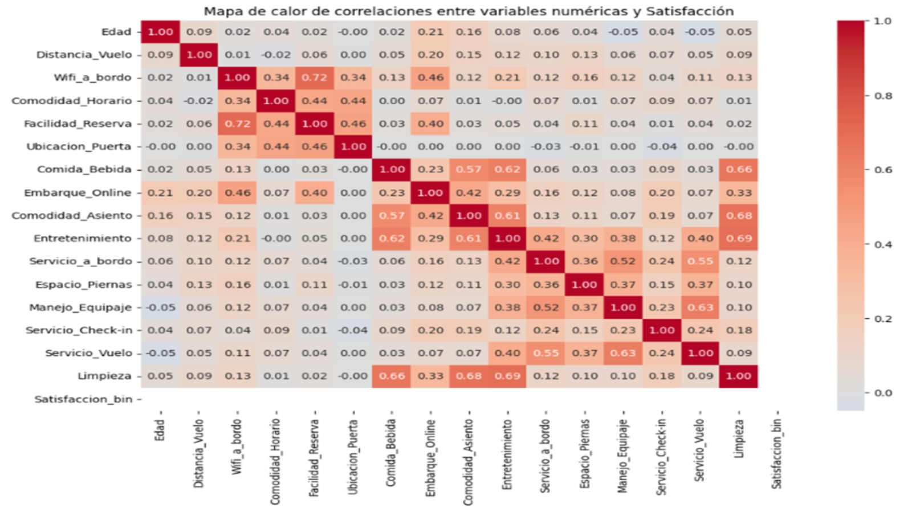
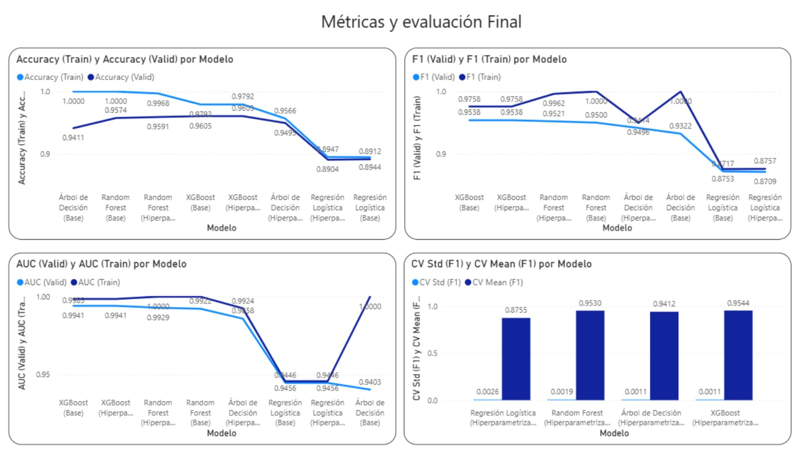
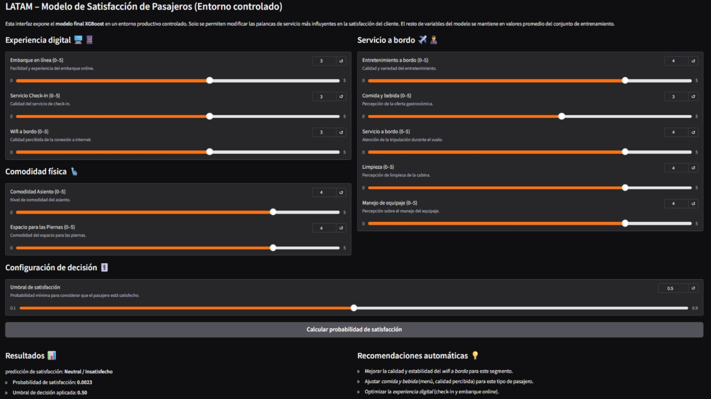

# NPS-Latam-Predictive-Model
Modelo de Machine Learning para predecir NPS y simulador de estrategias de fidelización para LATAM Airlines.

# ✈️ Optimización de NPS para LATAM Airlines

> *"Transformando encuestas en estrategias de retención con Inteligencia Artificial."*

Este proyecto desarrolla una solución integral de **Business Analytics** para predecir la satisfacción del cliente (NPS) e identificar los drivers clave de fidelización en la aerolínea.

## 🎯 Objetivo del Negocio
El reto no es solo predecir un número, sino actuar sobre él. El sistema busca:
1.  **Anticipar** clientes detractores antes de que abandonen la marca.
2.  **Simular** escenarios operativos (ej. *"¿Cuánto sube el NPS si mejoramos el Wifi un 10%?"*).
3.  **Personalizar** estrategias de retención basadas en datos reales.

---

## 🔍 Data Storytelling: Interpretación de Drivers
Antes de entrenar modelos, interrogamos a los datos para desafiar las intuiciones del negocio.

### El ADN de la Satisfacción
> 
>
> * **El Hallazgo:** Contrario a la intuición de que el "Precio" lo es todo, el mapa de calor revela que la **Experiencia a Bordo** (Confort del asiento, Wifi, Entretenimiento) tiene una correlación mucho más fuerte con la satisfacción final.
> * **Impacto:** Esto permite redirigir presupuestos hacia mejoras de UX (Experiencia de Usuario) con la certeza estadística de un mayor retorno en fidelidad.

---

## 🛠️ Solución Técnica
El proyecto implementa un pipeline de Machine Learning de extremo a extremo:

### 1. Modelo Predictivo (XGBoost)
* **Archivo:** `Modelo_Predictivo_NPS.ipynb`
* **Ingeniería de Datos:** Aplicación de **RFE (Recursive Feature Elimination)** para filtrar el ruido y seleccionar las 26 variables críticas del negocio.
* **Algoritmo:** **XGBoost Classifier** optimizado con `GridSearch`, superando en métricas a modelos tradicionales.

### 2. Validación de Resultados
> 
>
> * **Precisión Operativa:** El modelo fue calibrado para maximizar la detección de **Detractores** (Recall), asegurando que la aerolínea no pase por alto a los clientes en riesgo de fuga.

### 3. Simulador de Estrategias (Producto Final)
Para democratizar el uso de la IA, se diseñó una interfaz interactiva con **Gradio** que permite al equipo comercial simular decisiones en tiempo real.

> **Vista previa del Simulador:**
>
> 
>
> *Interfaz No-Code para la toma de decisiones basada en datos.*

---

## 🚀 Impacto y Conclusiones
* **Foco Estratégico:** Identificación de **"Confort en el Asiento"** y **"Wifi"** como las palancas más eficientes para elevar el NPS.
* **Segmentación Inteligente:** Capacidad de distinguir entre pasajeros sensibles al precio vs. sensibles a la experiencia para campañas de marketing dirigidas.

## 📦 Stack Tecnológico
* **Lenguaje:** Python 3.9+
* **Manipulación de Datos:** Pandas, NumPy.
* **Machine Learning:** Scikit-learn, XGBoost.
* **Despliegue/Demo:** Gradio.

---
*Proyecto desarrollado como parte del Summer Camp PUCP - Inteligencia Artificial | 2026*
